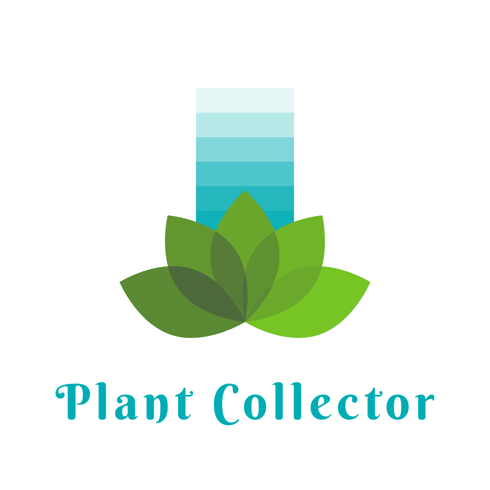

## Intro
Plant Collector is an app to prove how good or bad of a plant parent you are. Document the plants that are in your care and their maintanence (i.e., scheduled waterings and soil changes).
 
 
## Getting Started
- [Visit Plant Collector](https://plantcollector2023.fly.dev/)
 

## Attributions
- Images from freepik.com: [here](https://www.freepik.com/free-vector/organic-flat-houseplant-collection_13379179.htm) and [here](https://www.freepik.com/free-vector/organic-flat-houseplant-collection_13379163.htm)
 

## Technologies
- Django
- Python
- psycopg2
- bit.io
- Docker
- JavaScript / HTML / CSS
 

## Ice Box
- App is mobile friendly
- Users can upload their own photos
